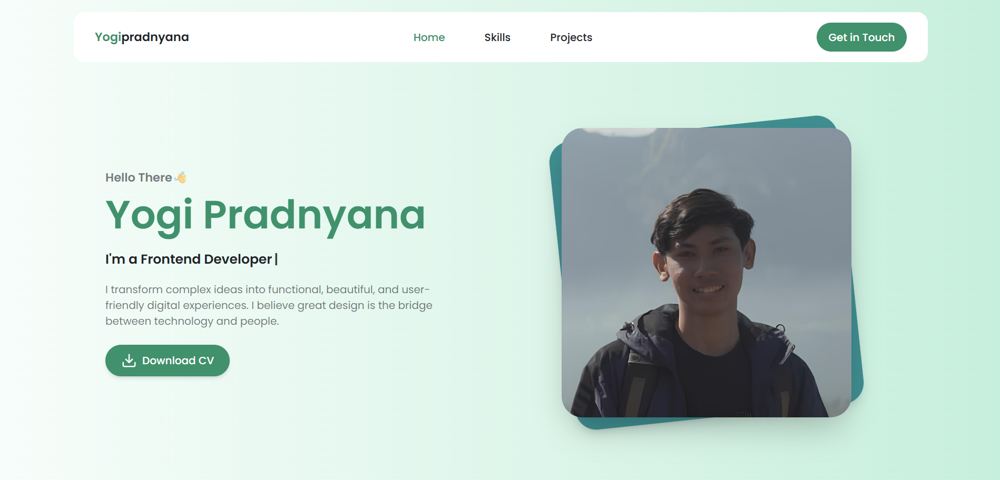

# Personal Portfolio Website V1

A clean, responsive, and interactive portfolio website built from scratch with React and Tailwind CSS. This project showcases my skills, my work, and my passion for creating user-friendly digital experiences.

**Live Demo:** [**https://personal-portfolio-yogi-pradnyanas-projects.vercel.app/**](https://personal-portfolio-yogi-pradnyanas-projects.vercel.app/)



---

## ✨ Features

- **Responsive Design:** Looks great on all devices, from mobile phones to desktops.
- **Single Page Application:** Smooth, anchor-link navigation without page reloads.
- **Dynamic Typing Effect:** An engaging "typewriter" effect on the hero section.
- **Active Link Highlighting:** The navbar automatically highlights the section currently being viewed using Intersection Observer.
- **Intelligent Navbar:** The navbar background and shadow appear conditionally upon scrolling past the hero section.
- **Functional Contact Form:** Sends emails directly to my inbox using EmailJS with beautiful SweetAlert2 notifications.
- **Custom SVG Icon System:** A robust icon component to handle custom vector graphics.
- **"See More" Functionality:** Dynamically loads more projects without leaving the page.

---

## 🛠️ Tech Stack & Tools

- **Frontend:** React.js, Vite
- **Styling:** Tailwind CSS v4
- **Email Service:** EmailJS
- **Alerts & Icons:** SweetAlert2, React-Icons
- **Deployment:** Vercel

---

## 🚀 Running Locally

1. Clone the repository:
   ```bash
   git clone https://github.com/YogiPradnyana/personal-portfolio.git
   ```
2. Navigate to the project directory:
   ```bash
   cd personal-portfolio
   ```
3. Install dependencies:
   ```bash
   npm install
   ```
4. Create a `.env` file in the root and add your EmailJS credentials:
   ```env
   VITE_EMAILJS_SERVICE_ID=your_service_id
   VITE_EMAILJS_TEMPLATE_ID=your_template_id
   VITE_EMAILJS_PUBLIC_KEY=your_public_key
   ```
5. Run the development server:
   ```bash
   npm run dev
   ```
